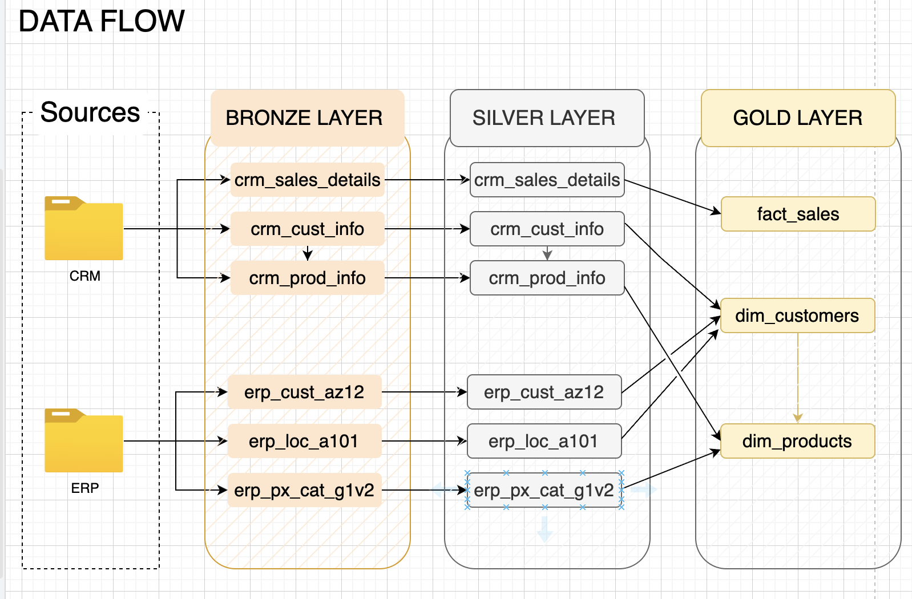

# SQL Data Warehouse ETL Pipeline

My first data engineering project. Took [Data Baraa's SQL tutorial](https://www.youtube.com/@DataWithBaraa) and extended it with Python automation and Docker.

## What it does

Loads CSV files (fake CRM + ERP data) through a Bronze → Silver → Gold pipeline into a star schema.

**What I added to the tutorial:**
- Python orchestration instead of manual SQL execution
- Docker setup so anyone can run it in 45 seconds
- Automated validation that fails fast if data is missing
- Type hints because I kept breaking things during refactoring

## Quick start
```bash
git clone https://github.com/orodriguezh33/sql-dwh-etl.git
cd sql-dwh-etl
docker compose up --build
```

First run: ~5 min (downloads SQL Server)  
After that: ~45 seconds

Connect:
- `localhost:1433`
- User: `sa` / Password: see `.env.example`
- Database: `DataWarehouse`

## Architecture
```
CSV → BRONZE (raw) → SILVER (cleaned) → GOLD (star schema)
```



**Bronze:** 6 tables, raw CSV data  
**Silver:** Cleaned dates, nulls, types  
**Gold:** 1 fact table + 2 dimensions (ready for Power BI)

## Project structure
```
sql-dwh-etl/
├── datasets/        # 6 CSV files (CRM + ERP)
├── sql/            # DDL and transformations
│   ├── 00_setup/
│   ├── 10_bronze/
│   ├── 20_silver/
│   └── 30_gold/
├── etl/            # Python orchestration
│   ├── pipeline.py
│   ├── runners.py
│   └── stages/
└── main.py
```

## What I learned

**Type hints actually matter**  
Started without them. Added gradually after breaking things 3 times during refactoring. They catch bugs at write-time instead of run-time.

**"Running" ≠ "Ready"**  
Docker said SQL Server was up, but connections failed for 15 seconds. Added health checks. Learned the hard way that process start ≠ service ready.

**Fail fast > fail late**  
First version would fail 30 seconds in when Gold views had no data. Now it fails in 5 seconds if Bronze tables are empty. Better error messages too.

**DRY applies to SQL**  
Had 6 identical validation queries (one per table). Built a Python function that generates them. 50 lines → 5 lines.

## Tech

- SQL Server 2022
- Python 3.12
- Docker Compose
- sqlcmd (subprocess calls)

## Known issues

- No retry logic if DB connection is flaky
- CSV parser breaks on commas inside quoted fields
- Logs only go to stdout (should write to files)
- Error messages could be friendlier

## What's from the tutorial vs what I built

**Tutorial (Data Baraa):**
- All the SQL logic (transformations, star schema)
- Table definitions
- BULK INSERT patterns

**What I added:**
- Entire Python layer (`etl/` folder)
- Docker setup with health checks
- Validation framework
- Protocol-based architecture (so I can add new step types easily)

## What I'd add next

- Airflow or Prefect for scheduling
- dbt for transformations instead of stored procedures
- Unit tests for the Python layer
- Azure Data Factory version (cloud migration)

## Credits

Tutorial by [Data Baraa](https://www.youtube.com/@DataWithBaraa) - great resource for learning SQL and dimensional modeling.

---

**First DE project. Feedback welcome.**
