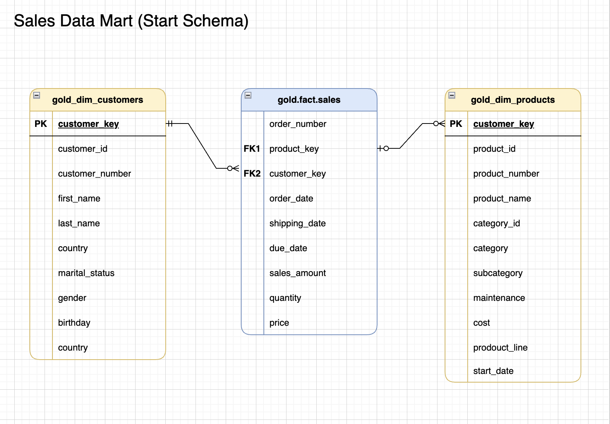
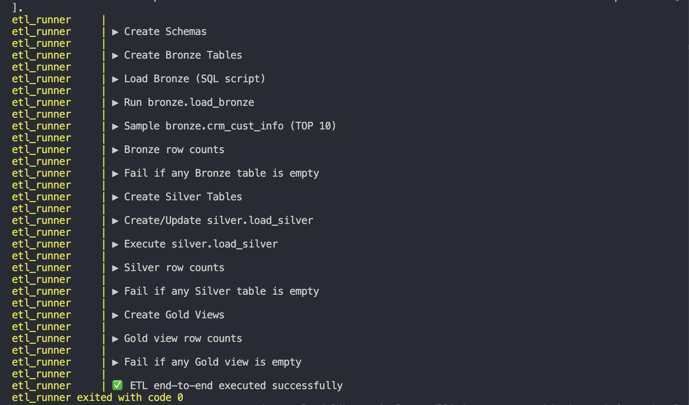

# SQL Data Warehouse ETL Pipeline

[](https://www.microsoft.com/sql-server)
[](https://www.python.org/)
[](https://www.docker.com/)

My first data engineering project. Took a SQL tutorial and built a production-ready ETL pipeline with Python orchestration, Docker containerization, and automated validation.

---

## What This Is

Built from [Data Baraa's SQL Data Warehouse tutorial](https://www.youtube.com/@DataWithBaraa). The tutorial teaches SQL and data warehousing in pure SQL - I extended it with a complete Python automation layer.

**What I added:**
- Protocol-based pipeline orchestration
- Type-safe execution with Python dataclasses
- Dynamic SQL validation generators
- Docker multi-container setup with health checks
- Fail-fast error handling

Transforms CSV data (CRM + ERP sources) through Bronze → Silver → Gold layers into a star schema ready for BI tools.

**Time investment:** ~3 weeks of learning and iteration

---

## Quick Start

```bash
git clone https://github.com/orodriguezh33/sql-dwh-etl.git
cd sql-dwh-etl
docker compose up --build
```

First run: ~5 min (downloads SQL Server image)  
Subsequent runs: ~45 seconds

**Pipeline output:**
```
▶ Create Schemas
▶ Create Bronze Tables
▶ Load Bronze (SQL script)
▶ Sample bronze.crm_cust_info (TOP 10)
▶ Bronze row counts
▶ Fail if any Bronze table is empty
▶ Create Silver Tables
▶ Execute silver.load_silver
▶ Silver row counts
▶ Fail if any Silver table is empty
▶ Create Gold Views
▶ Gold view row counts
✅ ETL end-to-end executed successfully
```

**Connect to the database:**
- Host: `localhost:1433`
- User: `sa`  
- Password: (see `.env.example`)
- Database: `DataWarehouse`

---

## Architecture

```
CSV Files → BRONZE (raw) → SILVER (cleaned) → GOLD (analytics)
```

**Bronze:** 6 tables with raw data from CSVs  
**Silver:** Cleaned and standardized (dates, nulls, types)  
**Gold:** 3 views in star schema (1 fact + 2 dimensions)

### Data Flow


### Star Schema


### Source Systems


---

## Project Structure

```
sql-datawarehouse-etl/
├── datasets/
│   ├── source_crm/          # 3 CSV files (CRM system)
│   └── source_erp/          # 3 CSV files (ERP system)
├── sql/
│   ├── 00_setup/           # Database & schema DDL
│   ├── 10_bronze/          # Raw data ingestion
│   ├── 20_silver/          # Transformations
│   ├── 30_gold/            # Star schema views
│   └── test/               # Quality check queries
├── etl/
│   ├── pipeline.py         # Orchestration (Protocol-based)
│   ├── runners.py          # SQL execution (subprocess)
│   ├── config.py           # Settings from environment
│   ├── stages/             # Bronze/Silver/Gold steps
│   └── checks/             # SQL validation generators
├── docker-compose.yml
├── Dockerfile
└── main.py                 # Entry point
```

---

## What I Learned

**Python type hints catch bugs before runtime**  
Started without types, added them gradually. Caught 3 bugs during refactoring that would've been runtime failures. Now I get why production code is heavily typed - it's not just documentation, it's prevention.

**Protocol pattern makes extension easier**  
First tried abstract base classes for pipeline steps. Protocols are more flexible - I can add new step types (QueryStep, SqlFileStep) without modifying the core EtlPipeline class. Makes the code actually extensible, not just theoretically.

**Dynamic SQL generation beats copy-paste**  
Writing validation for 6 Bronze tables meant 6 identical IF statements. Built `build_fail_if_zero_sql()` that generates them programmatically. Changed ~50 lines of SQL to 5 lines of Python. Same pattern works for any number of tables.

**Immutable dataclasses prevent silent bugs**  
Used `frozen=True` after accidentally mutating a step config mid-execution (spent an hour debugging). Frozen dataclasses make that impossible - the error surfaces immediately at assignment, not later when data is corrupted.

**Health checks are not optional**  
Docker says SQL Server is "started" but connections fail for 10-15 seconds. Spent a day debugging this. `service_healthy` condition waits for actual readiness, not just process start. Learned: in distributed systems, "running" ≠ "ready".

**Fail-fast saves debugging time**  
First version kept going even when Bronze tables were empty. Would notice problems 30 seconds later in Gold views. Added validation that throws SQL errors immediately (with unique error codes 50001, 50002...). Better to fail in 5 seconds with a clear message than succeed with bad data.

---

## Design Decisions

**Why Protocols over ABC?**  
Protocols don't require inheritance. New step types just need a `name` property and `run()` method. Makes the pipeline truly open for extension without coupling to a base class.

**Why frozen dataclasses?**  
Pipeline steps should be immutable - they represent configuration, not mutable state. `frozen=True` makes bugs impossible instead of requiring discipline.

**Why generate SQL programmatically?**  
Validation logic is identical for all tables, only names differ. Generating it means adding tables is trivial and patterns stay consistent.

**Why custom error numbers?**  
SQL Server's `THROW` lets you assign error codes (50001+). Each validation gets a unique number, so logs tell you exactly what failed without reading stack traces.

---

## Tech Stack

- **SQL Server 2022** - Data warehouse
- **Python 3.12** - Orchestration with type hints
- **Docker Compose** - Multi-container coordination  
- **sqlcmd** - SQL execution (subprocess)

---

## Known Issues

- No retry logic for transient connection failures
- Error messages pass through SQL Server errors verbatim (could be friendlier)
- CSV parsing breaks on commas inside quoted fields
- Would benefit from logging to files (currently stdout only)

---

## What's Mine vs Tutorial

**From the tutorial (Data Baraa):**
- SQL transformation logic (Bronze/Silver/Gold)
- Star schema design for analytics
- BULK INSERT patterns for CSV loading
- Table definitions and relationships

**What I built:**
- Entire Python codebase (`etl/` directory):
  - Protocol-based pipeline architecture
  - Type-safe step execution with dataclasses
  - Dynamic SQL validation generators  
  - SqlCmdRunner with subprocess error handling
- Complete Docker setup:
  - Multi-container orchestration
  - Health checks and service dependencies
  - Volume mounting for data/SQL
- Validation framework:
  - Programmatic SQL generation
  - Fail-fast checks at each layer
  - Sample data output for debugging
- Project organization and structure

---

## Pipeline Execution

### Running the Pipeline

*Shows the complete execution flow with validation at each layer*

---

## Credits

Based on [Data Baraa's SQL Data Warehouse tutorial series](https://www.youtube.com/@DataWithBaraa). Excellent resource for learning SQL and dimensional modeling fundamentals.

---

## License

MIT License

---

**⭐ Star if you found this useful!**

*First data engineering project - feedback welcome*
